# mottu-previsao-demanda

## ⚙️ Como rodar o projeto

### Pré-requisitos
- Python 3.13+
- Conta Google Cloud com acesso ao projeto `dm-mottu-aluguel`
- [`gcloud CLI`](https://cloud.google.com/sdk/docs/install) instalado

### 1. Clone o repositório
```bash
git clone https://github.com/pedrolucas-campos/mottu-previsao-demanda.git
cd mottu-previsao-demanda
```

### 2. Crie e ative o ambiente virtual
```bash
python -m venv .venv
source .venv/bin/activate  # Linux/Mac
.venv\Scripts\activate     # Windows
```

### 3. Instale as dependências
```bash
pip install -r requirements.txt
```

### 4. Autentique no Google Cloud
```bash
gcloud auth application-default login
```

### 5. Gere seus .csv e abra os notebooks

Para o notebook `02_exploracao.ipynb`:
```bash
python3 tabela-demanda.py
# abra o notebook com o kernel python .venv
```

Para o notebook `03_exploracao_contratos.ipynb`:
```bash
python3 contratos_lugar_produtos.py
# abra o notebook com o kernel python .venv
```

---

## 📊 Visualizações

### Demanda Total
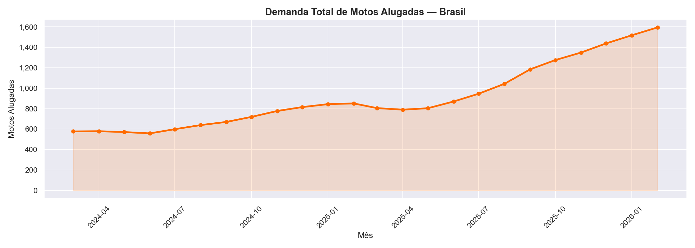

### Contratos: Aluguel vs Venda
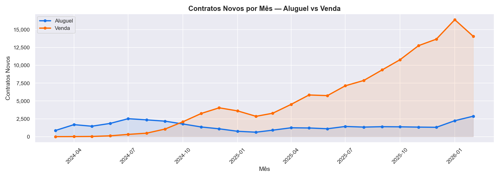

### Evolução dos Top 8
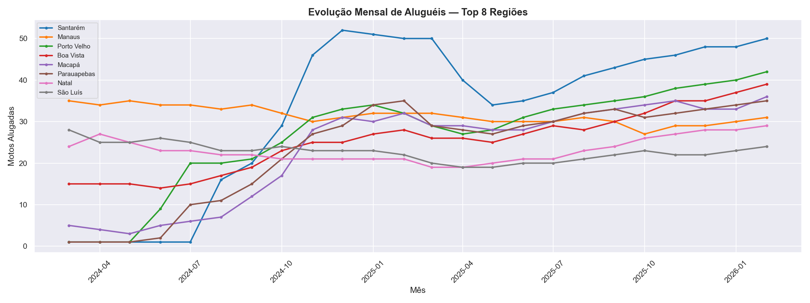

### Heatmap de Sazonalidade
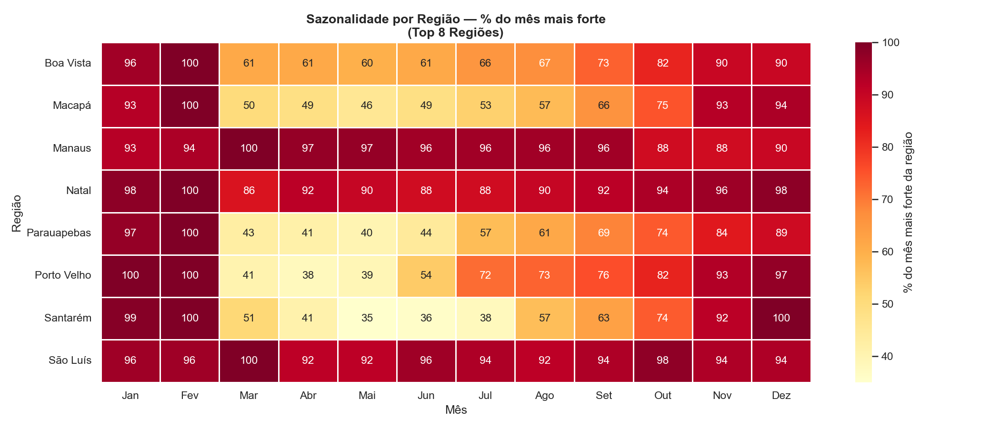

### Mix por Tipo de Moto
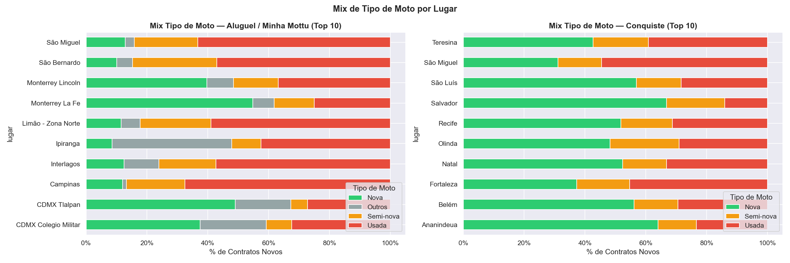

### MoM — Contratos
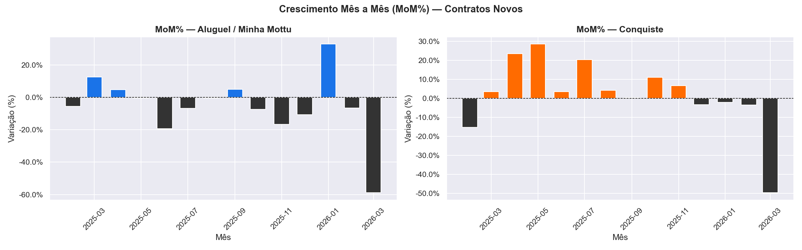

### MoM — Demanda
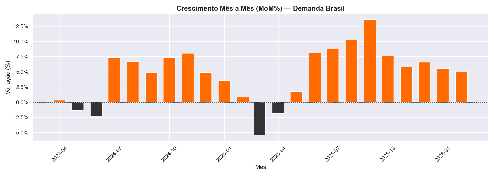

### Taxa de Renovação
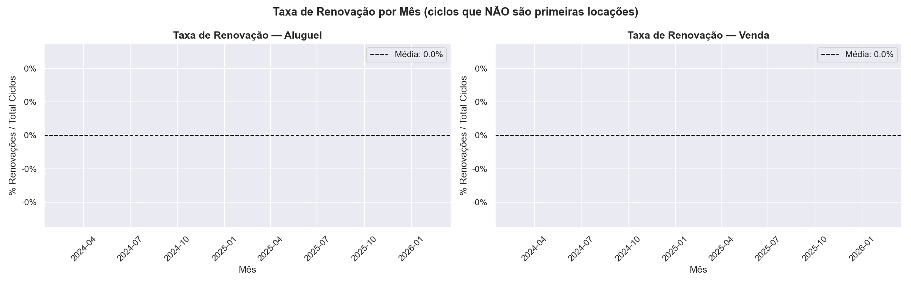

### Distribuição por Tipo de Moto
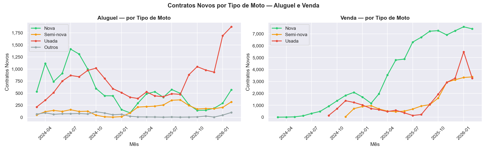

### Top Lugares
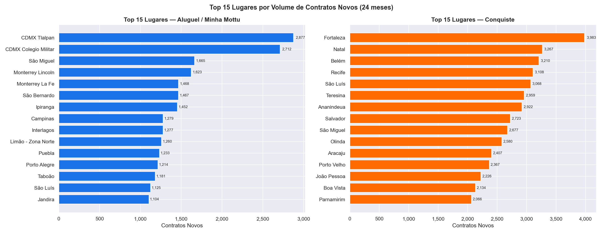

### Top Regiões
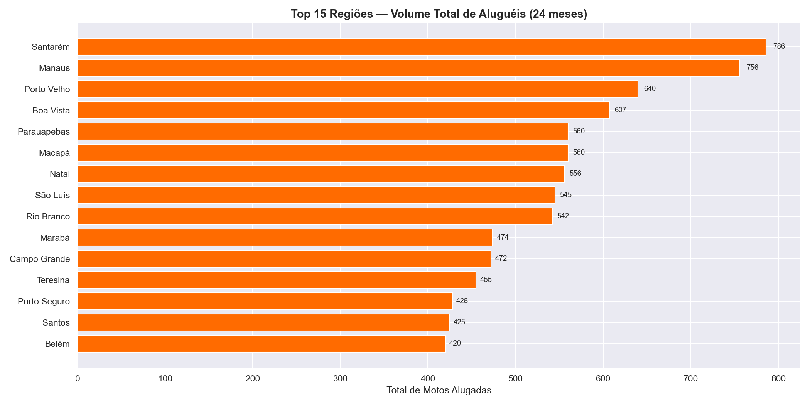
